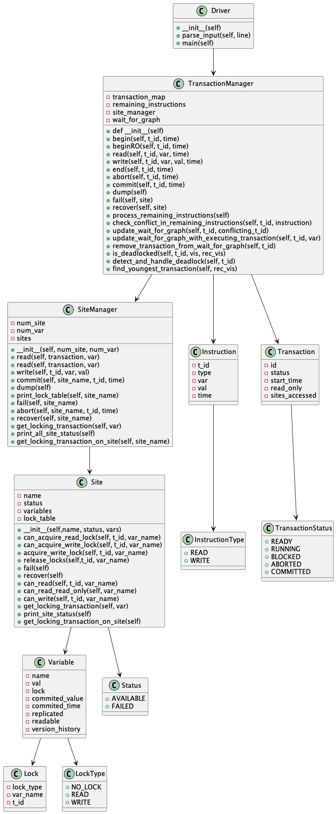

# <center>Replicated Concurrency Control and Recovery</center>
# <center>Design Document</center>

<div align="right"> Sameer Ahmed - sa6142 </div>
<div align="right"> Revanth G - rg4037 </div>
<div align="right"> Dec 3, 2022 </div>


### Class Interconnection Diagram




### Introduction 

We have implemented a distributed database, complete with multiversion concurrency control, deadlock detection, replication, and failure recovery with data as mentioned in the project specification. We have used the available copies algorithm  approach to replication using strict two phase locking (using read and write locks) at each site and validation at commit time. Read-only transactions have been implemented using multiversion read consistency. We have also implemented to detect deadlocks using cycle detection and abort the youngest transaction in the cycle, if there is any deadlock detected.

### Running

At the root of the project, run 

```
$ python driver.py <input_file_path>
``` 

Sample Inputs:

Note : The input file should not have any empty lines.
``` 
//Sample Input 1
// All should commit
begin(T1)
begin(T2)
R(T1,x2)
R(T2,x2)
W(T2,x2,10)
end(T1)
end(T2)
```

```
//Sample Input 2
// T3 must wait till the commit of T2 before it reads x4
// (because of locking), so sees 44.
// T3 must abort though because the lock information is lost on site 4 
// upon failure
// T1 reads the initial value of x2 because T3 has aborted.
begin(T3)
begin(T1)
begin(T2)
W(T3,x2,22)
W(T2,x3,44)
R(T3,x3)
end(T2)
fail(4)
end(T3)
R(T1,x2)
end(T1)
```

## Data Models

Below are the Data Models used in the Project to build a distributed database system.

```python
class Variable:

    def __init__(self, name, val, lock, replicated = False):
 
        self.name = name
        self.val = val
        self.lock = lock
        self.commited_value = val
        self.commited_time = 0
        self.replicated = replicated
        self.readable = True
        self.version_history = {0:val} #dict of time and val
```

```python
class Site:

    def __init__(self,name, status, vars):

        self.name = name
        self.status = status
        self.variables = vars #dict of var name and var obj
        self.lock_table = defaultdict(list) # dict of var name and list of locks
```


```python
class Lock:

    def __init__(self, lock_type, var_name, t_id=None):

        self.lock_type = lock_type
        self.var_name = var_name
        self.t_id = t_id

```

```python
class Transaction:

    def __init__(self, id, status, start_time, read_only = False):
       
        self.id = id
        self.status = status
        self.start_time = start_time
        self.read_only = read_only
        self.sites_accessed = set()

```

```python
class Instruction:
    
    def __init__(self, t_id, ins_type, var, val, time):

        self.t_id = t_id
        self.type = ins_type
        self.var = var
        self.val = val
        self.time = time
```


## CLASSES - LOGICAL DESCRIPTION 


**Site** class describes a Data Site .

```python
class Site:

    def __init__(self,name, status, vars):
        '''creates and initialises a new Site

        Parameters:
            self(Site): instance of the class
            name(string): name of the site
            status(Status): status of the Site i.e AVAILABLE, FAILED
            vars(dict): dictionary of variable name and object

        Returns:
            Site: a new Site object initialized with the given values
        ''' 

    def can_acquire_read_lock(self, t_id, var_name):
        '''Method to test if a read lock can be acquired by transaction t_id on variable var_name

        Parameters:
            self(Site): instance of the class
            t_id(string): name of the transaction
            var_name(string): name of the var_name

        Returns:
            Boolean: return True if t_id can acquire Read lock otherwise False
        '''

    def acquire_read_lock(self, t_id, var_name):
        '''Method to acquire read lock by transaction t_id on variable var_name

        Parameters:
            self(Site): instance of the class
            t_id(string): name of the transaction
            var_name(string): name of the var_name

        SideEffect:
            Add the lock to the locktable of the current site.
        '''

    def can_acquire_write_lock(self, t_id, var_name):
        '''Method to test if a write lock can be acquired by transaction t_id on variable var_name

        Parameters:
            self(Site): instance of the class
            t_id(string): name of the transaction
            var_name(string): name of the var_name

        Returns:
            Boolean: return True if t_id can acquire Write lock otherwise False
        ''' 

    def acquire_write_lock(self, t_id, var_name):
        '''Method to acquire write lock by transaction t_id on variable var_name

        Parameters:
            self(Site): instance of the class
            t_id(string): name of the transaction
            var_name(string): name of the var_name

        SideEffect:
            if lock doesn't exist then add the lock to the locktable of the current site otherwise
            promotes the lock to a Write lock.
        '''


    def release_locks(self,t_id, var_name):
        '''Method to release locks by transaction t_id on variable var_name

        Parameters:
            self(Site): instance of the class
            t_id(string): name of the transaction
            var_name(string): name of the var_name

        SideEffect:
            update the lock table of the current site by removing all the locks held by t_id on var_name
        '''

    def fail(self):
        '''Method to fail a Site

        Parameters:
            self(Site): Object of Site class

        SideEffect:
            update the status of the Site to Failed and clear all the locks held at the Site
        '''
    
    def recover(self):
        '''Method to recover a failed Site

        Parameters:
            self(Site): Object of Site class
            
        SideEffect:
            update the status of a failed Site to Available
        '''
    
    def can_read(self, t_id, var_name):
        '''Method to test if the given transaction can read the given variable at this Site

        Parameters:
            self(Site): instance of the class
            t_id(string): name of the transaction
            var_name(string): name of the var_name

        Returns:
            Boolean: return True if t_id can read var_name at this Site
        '''         

    def can_read_read_only(self, var_name):
        '''Method to test if the given variable can be read at this Site

        Parameters:
            self(Site): instance of the class
            var_name(string): name of the var_name

        Returns:
            Boolean: return True if var_nam can be read at this Site otherwise False
        '''      

    def can_write(self, t_id, var_name):
        '''Method to test if the given transaction can write the given variable at this Site
        Parameters:
            self(Site): instance of the class
            t_id(string): name of the transaction
            var_name(string): name of the var_name
        Returns:
            Boolean: return True if t_id can write to var_name at this Site
        '''

    def get_locking_transaction(self, var):
        '''Method to get all the transactions that hold lock on variable var at this Site.

        Parameters:
            self(Site): instance of the class
            var(string): name of the variable

        Returns:
            set: a set of transactions that has lock on the given variable
        '''
    
    def print_site_status(self):
        '''Method to print the status of this Site.

        Parameters:
            self(Site): instance of the class.

        SideEffect:
            prints the name and status of the Site
        ''' 

    def get_locking_transaction_on_site(self):
        '''Method to get all the transactions that hold lock on any variable at this Site.

        Parameters:
            self(Site): instance of the class.

        Returns:
            set: a set of transactions that has lock on any variable at this Site.
        '''

```


**SiteManager** class  manages all the sites and abstracts the underlying distribution of the Site

```python
class SiteManager:

    def __init__(self, num_site, num_var):
        '''creates and initialises a new Site Manager

        Parameters:
            self(SiteManager): instance of the class.

        Returns:
        Instruction: a new SiteManager object initialized with give number of Sites and Variables.
        '''

    def read(self, transaction, var):
        '''Reads the variable var for the given transaction

        Parameters:
            self(SiteManager): instance of the class.
            transaction(Transaction): instance of transaction
            var(string): name of the variable whose value is being accessed

        Returns:
        tuple: a tuple of variable values and site from which it is read
        '''
        
    def write(self, t_id, var, val):
        '''Writes the variable var with the value val for the given transaction t_id

        Parameters:
            self(SiteManager): instance of the class.
            t_id(string): id of the transaction
            var(string): name of the variable whose value is being accessed
            val(int): value to which the variable var needs to be written

        Returns:
        list: a list of all sites to which var is written
        ''' 
 
    def commit(self, site_name, t_id, time):
        '''commit the transaction with id t_id

        Parameters:
            self(SiteManager): instance of the class.
            t_id(string): id of the transaction
            var(string): name of the variable whose value is being accessed
            val(int): value to which the variable var needs to be written

        Returns:
        list: a list of all sites to which var is written
        '''
    
    def dump(self):
        '''Prints the site name and all current committed state of each variable that it contains

        Parameters:
            self(SiteManager): instance of the class.        
        '''

    def print_lock_table(self, site_name):
        '''Prints the lock table of the give site.
        
        Parameters:
            self(SiteManager): instance of the class. 
            site_name(string): name of the site.      
        '''

    def fail(self, site_name):
        '''Fails the given site.

        Parameters:
            self(SiteManager): instance of the class. 
            site_name(string): name of the site.      
        ''' 
    
    def abort(self, site_name, t_id, time):
        '''Aborts the transaction t_id

        Parameters:
            self(SiteManager): instance of the class. 
            site_name(string): name of the site.   
            t_id(string): transaction id
            time: time of abort

        SideEffect:
            Removes all the locks held by transaction t_id at site site_name
        '''

    def recover(self, site_name):
        '''Recovers the given failed site

        Parameters:
            self(SiteManager): instance of the class. 
            site_name(string): name of the site.   
        '''

    def get_locking_transaction(self, var):
        '''Method to get all the transactions that hold lock on variable var.

        Parameters:
            self(SiteManager): instance of the class
            var(string): name of the variable

        Returns:
            set: a set of transactions that has lock on the given variable
        ''' 

    def print_all_site_status(self):
        '''Method to print the status of all the Sites.

        Parameters:
            self(SiteManager): instance of the class.

        SideEffect:
            prints the name and status of each Site
        '''

    def get_locking_transaction_on_site(self, site_name):
        '''Method to get all the transactions that hold lock on any variable at this Site.

        Parameters:
            self(SiteManager): instance of the class.
            site_name(string): name of the site

        Returns:
            set: a set of transactions that has lock on any variable at this Site.
        ''' 
```


**TransactionManager** class manages all the transactions

```python
class TransactionManager:

    def __init__(self):
        '''creates and initialises a new Transaction Manager

        Parameters:
            self(TransactionManager): instance of the class

        Returns:
            TransactionManager: a new TransactionManager object initialized with the given values
        '''

    def begin(self, t_id, time):
        '''Begins a new transaction with transaction id, t_id at time, time.

        Parameters:
            self(TransactionManager): instance of the class
            t_id(string): transaction id
            time(int): time when the transaction begins

        SideEffect:
            creates a new transaction and adds it to the transaction_map
        '''

    def beginRO(self, t_id, time):
        '''Begins a new read-only transaction with transaction id, t_id at time, time.

        Parameters:
            self(TransactionManager): instance of the class
            t_id(string): transaction id
            time(int): time when the transaction begins

        SideEffect:
            creates a new read-only transaction and adds it to the transaction_map
        ''' 

    def read(self, t_id, var, time):
        '''Reads the value of the var for transaction, t_id at time, time.

        Parameters:
            self(TransactionManager): instance of the class
            t_id(string): transaction id
            var(string): name of the variable
            time(int): time of instruction

        SideEffect:
            Reads and prints the value of the given var.
            If variable cannot be read due to lock conflicts then blocks it and add to waiting instructions.
            Updates wait-for graph
        '''


    def write(self, t_id, var, val, time):
        '''Write the var with value, val for transaction, t_id at time, time.

        Parameters:
            self(TransactionManager): instance of the class
            t_id(string): transaction id
            var(string): name of the variable
            val(string): value to be written
            time(int): time of instruction

        SideEffect:
            Write value, val to the variable, var.
            If variable cannot be written due to lock conflicts,then  blocks it and add to waiting instructions.
            Updates the wait-for graph
        '''

    def end(self, t_id, time): 
        '''Ends the transaction t_id, either commits or aborts. Thereafter process remaining instructions

        Parameters:
            self(TransactionManager): instance of the class
            t_id(string): transaction id
            time(int): time of instruction
        '''

    def abort(self, t_id, time):
        '''Abort the transaction. Thereafter process remaining instructions

        Parameters:
            self(TransactionManager): instance of the class
            t_id(string): transaction id
            time(int): time of instruction

        SideEffect:
            Removes the transaction, t_id from the transaction_map
        ''' 

    def commit(self, t_id, time):
        '''Commit the transaction. Thereafter process remaining instructions

        Parameters:
            self(TransactionManager): instance of the class
            t_id(string): transaction id
            time(int): time of instruction

        SideEffect:
            Removes the transaction, t_id from the transaction_map
        ''' 

    def dump(self):
        '''Print the current state of sites and committed variables. 

        Parameters:
            self(TransactionManager): instance of the class
        '''

    def fail(self, site):
        '''Fails the given site. If a transaction has accessed this site it is marked as Aborted.

        Parameters:
            self(TransactionManager): instance of the class. 
            site_name(string): name of the site.      
        '''

    def recover(self, site):
        '''Recovers the given failed site

        Parameters:
            self(TransactionManager): instance of the class. 
            site_name(string): name of the site.   
        '''          

    def process_remaining_instructions(self):
        '''Process the remaining instructions in blocked state.

        Parameters:
            self(TransactionManager): instance of the class. 

        SideEffect:
            Process the remaining instructions that can be processed, and keep other in the list  
        '''
    def check_conflict_in_remaining_instructions(self, t_id, instruction):
        '''Check conflicts of the current t_id with the already remaining instructions

        Parameters:
            self(TransactionManager): instance of the class. 
            t_id(string): transaction id of the instruction
            instruction(Instruction): Instruction object containing all the information regarding the instruction

        Returns:
            transaction id of conflicting instruction
        '''

    def update_wait_for_graph(self, t_id, conflicting_t_id):
        '''Updates the wait_for_graph to add an edge from t_id to conflicting_t_id

        Parameters:
            self(TransactionManager): instance of the class. 
            t_id(string): transaction id of the instruction
            conflicting_t_id(string): transaction id of the conflicting instruction

        SideEffect:
            Add an edge from t_id to conflicting_t_id in the wait_for_graph
        '''

    def update_wait_for_graph_with_executing_transaction(self, t_id, var):
        '''Updates the wait_for_graph to add an edge from t_id to all other transaction that has lock on the variable, var

        Parameters:
            self(TransactionManager): instance of the class. 
            t_id(string): transaction id of the instruction
            var(string): variable name

        SideEffect:
            Add an edge from t_id to to all other transaction that has lock on the variable, var
        ''' 

    def remove_transaction_from_wait_for_graph(self, t_id):
        '''Removes the transaction t_id from the wait_for_graph.

        Parameters:
            self(TransactionManager): instance of the class. 
            t_id(string): transaction id of the instruction

        SideEffect:
            Removes the transaction t_id from each transactions values and remove the t_id from the wait_for_graph.
        '''

    def is_deadlocked(self, t_id, vis, rec_vis):
        '''Check if the current state of wait-for-graph contains a cycle

        Parameters:
            self(TransactionManager): instance of the class. 
            t_id(string): transaction id of the instruction
            vis(set): set of nodes already visited
            rec_vis(set): set of nodes visited in current recursion

        Returns:
            True if the wait_for_graph contains cycle otherwise False
        ''' 

    def detect_and_handle_deadlock(self, t_id):
        '''Check if the current state of wait-for-graph leads to deadlock

        Parameters:
            self(TransactionManager): instance of the class. 
            t_id(string): transaction id of the instruction

        SideEffect:
            If deadlock if found Aborts the youngest transaction in the wait_for_graph cycle.
        '''

    def find_youngest_transaction(self, rec_vis):
        '''find the youngest transaction in the wait_for_graph cycle.

        Parameters:
            self(TransactionManager): instance of the class. 
            rec_vis(string): sub-graph in wait-for-graph that has cycle

        Returns:
            tuple: return tuple of youngest transaction and time.
        '''

```

```python

```


### DRIVER CODE 

This is the driver code to run the program.

```python

class Driver:

    def __init__(self):
        self.main()

    def parse_input(self, line):
        '''Parses the input line

        Parameters:
            line(string): single line from the input file
        Returns:
            tuple: a tuple of the command and list of args
            args length varies based on the Read, Write, dump commands
        '''
    def main(self):
        '''Starting point of the application'''    
       
Driver()

```

